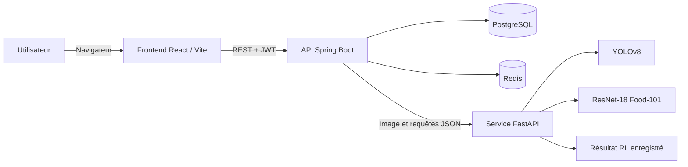

# SmartMeal (SMEAL)

SmartMeal est une application web qui analyse une photo de repas, identifie des aliments parmi les 101 classes de Food-101 et présente des repères nutritionnels. Les utilisateurs peuvent créer un compte, retrouver leurs analyses et consulter les suggestions associées à un repas.

Le dépôt réunit une interface React, une API Spring Boot, un service d’inférence Python et des ressources d’expérimentation en apprentissage automatique.

## Fonctionnalités

- Création de compte, connexion et déconnexion avec des jetons JWT et des jetons de renouvellement.
- Import d’une photo JPEG ou PNG (20 Mo maximum) pour analyser un repas.
- Détection de régions avec YOLOv8, puis classification des régions avec ResNet-18 entraîné pour les 101 classes Food-101. Si le détecteur ne renvoie pas d’objet, l’image entière est classifiée.
- Calcul d’un score santé et d’une lettre de A à E à partir des valeurs nutritionnelles disponibles.
- Affichage de repères nutritionnels, d’un tableau de bord et d’un historique paginé.
- Enregistrement des analyses liées au compte et affichage de leurs détails.
- Suggestions calculées à partir de la combinaison de repas enregistrée dans `models/rl_results.json`.

## Architecture



Le frontend appelle l’API Spring Boot sous `/api`. L’API gère l’authentification, les données de repas, le calcul du score et les échanges avec PostgreSQL, Redis et le service ML. Le service FastAPI charge les poids des modèles au démarrage.

## Technologies

| Partie | Technologies |
|---|---|
| Interface | React 19, TypeScript, Vite 7, Tailwind CSS 4, React Router, Zustand, Axios |
| API | Java 17, Spring Boot 3, Spring Security, Spring Data JPA, JWT |
| Données et cache | PostgreSQL 16, Redis 7 |
| Inférence ML | Python 3.11, FastAPI, PyTorch, Torchvision, Ultralytics YOLO, Pillow |
| Environnement | Docker Compose |

## Structure du dépôt

```text
.
├── frontend/                    # Application web React
├── smeal-backend/
│   ├── src/main/java/            # API Spring Boot
│   ├── src/main/resources/       # Configuration, schéma et données nutritionnelles
│   └── ml-service/               # API FastAPI et image Docker ML
├── models/                       # Poids ResNet et résultat RL
├── yolov8n.pt                    # Poids du détecteur YOLO
├── src/app.py                    # Ancien prototype Streamlit
├── src/config.json               # Liste des classes Food-101
├── notebooks/                    # Notebooks d’exploration et d’expérimentation
└── reports/                      # Graphiques et résultats visuels
```

## Lancer l’application

### Prérequis

- Docker Desktop avec Docker Compose.
- Node.js et npm pour lancer le frontend localement.
- Un accès à Internet lors du premier build Docker pour récupérer les images et dépendances.

Le lancement Docker principal ne demande pas d’installer Java, Maven ou Python sur la machine hôte : ces composants sont installés dans les images. Java 17 et Maven sont nécessaires uniquement pour lancer ou compiler l’API en dehors de Docker.

### 1. Configurer les variables d’environnement

Depuis la racine du dépôt, copiez le modèle puis modifiez les valeurs de secret :

```powershell
Copy-Item .env.example .env
```

Définissez au minimum :

- `DATABASE_PASSWORD` : mot de passe PostgreSQL choisi pour cet environnement.
- `JWT_SECRET` : secret aléatoire d’au moins 32 octets pour signer les jetons.

Ne publiez pas le fichier `.env` ni de vrais secrets dans le dépôt.

### 2. Démarrer les services backend

Depuis la racine du dépôt :

```powershell
docker compose --env-file .env -f smeal-backend/docker-compose.yml up --build
```

Compose démarre PostgreSQL, Redis, le service ML et l’API Spring Boot. La base est initialisée avec le schéma et les données nutritionnelles fournis dans `smeal-backend/src/main/resources/`.

L’API est disponible sur `http://localhost:8082/api`. Vérifiez son état avec `GET http://localhost:8082/api/v1/health`.

### 3. Démarrer le frontend

Dans un second terminal :

```powershell
cd frontend
npm install
npm run dev
```

Vite affiche l’adresse du frontend, généralement `http://localhost:5173`. Par défaut, le client appelle `http://localhost:8082/api`. Pour utiliser une autre adresse, définissez `VITE_API_URL` (par exemple dans `frontend/.env.local`) avec l’URL de base de l’API, en incluant `/api`.

## Variables de configuration

| Variable | Utilisée par | Rôle |
|---|---|---|
| `DATABASE_PASSWORD` | Docker Compose / Spring | Mot de passe PostgreSQL, obligatoire pour Compose |
| `JWT_SECRET` | Spring | Clé secrète JWT, au moins 32 octets |
| `DATABASE_URL` | Spring | URL JDBC ; Compose utilise l’adresse interne du service PostgreSQL |
| `DATABASE_USERNAME` | Spring / Compose | Identifiant PostgreSQL |
| `REDIS_HOST`, `REDIS_PORT` | Spring | Adresse Redis ; Compose configure le nom de service `redis` |
| `ML_API_URL` | Spring | Adresse FastAPI ; par défaut `http://localhost:5000` en local |
| `UPLOAD_PATH` | Spring | Répertoire de stockage des images ; par défaut `./uploads` |
| `FRONTEND_ORIGIN` | Spring | Origine(s) frontend autorisée(s) par CORS |
| `VITE_API_URL` | Vite | URL de base de l’API ; par défaut `http://localhost:8082/api` |

Les ports publiés par le Compose fourni sont `8082` (API), `5000` (ML), `5433` (PostgreSQL) et `6380` (Redis). PostgreSQL et Redis sont publiés sur l’interface locale de la machine.

## Parcours dans l’application

1. L’utilisateur s’inscrit ou se connecte depuis l’interface.
2. Il choisit une photo JPEG/PNG de 20 Mo maximum et demande son analyse.
3. Spring vérifie le fichier, l’envoie au service ML et récupère les aliments reconnus.
4. Le backend associe les données nutritionnelles disponibles, calcule le score, enregistre l’analyse et renvoie le résultat.
5. Le frontend affiche les aliments, le score, les repères nutritionnels, les suggestions et l’image disponible localement dans le navigateur.

Les jetons d’accès sont envoyés dans l’en-tête `Authorization: Bearer …`. Le client tente de renouveler une session expirée avec le jeton de renouvellement. Redis sert au suivi des jetons de renouvellement, à la révocation des jetons d’accès et au cache temporaire des résultats de classification.

## API REST

Base locale : `http://localhost:8082/api`. Les routes suivantes sont sous `/v1`. Toutes les routes demandent une authentification JWT, sauf l’inscription, la connexion, le renouvellement et le contrôle de santé.

| Méthode | Route | Description |
|---|---|---|
| `POST` | `/v1/auth/register` | Créer un compte (`email`, `password`, `name`) |
| `POST` | `/v1/auth/login` | Se connecter (`email`, `password`) |
| `POST` | `/v1/auth/refresh` | Renouveler les jetons (`refreshToken`) |
| `POST` | `/v1/auth/logout` | Fermer la session et révoquer les jetons |
| `GET` | `/v1/health` | Vérifier l’état de l’API |
| `POST` | `/v1/meals/analyze` | Analyser une image multipart nommée `image` |
| `GET` | `/v1/meals/history?offset=0&limit=20` | Lister les analyses du compte connecté |
| `GET` | `/v1/meals/{mealId}` | Obtenir le détail d’une analyse |
| `DELETE` | `/v1/meals/{mealId}` | Supprimer un enregistrement de repas |
| `GET` | `/v1/nutrition/foods?search=pizza&limit=50` | Rechercher des aliments |
| `GET` | `/v1/nutrition/foods/{name}` | Obtenir les données d’un aliment |
| `POST` | `/v1/recommendations/suggest` | Obtenir des suggestions pour les aliments transmis |

Exemple de requête d’analyse :

```bash
curl -X POST http://localhost:8082/api/v1/meals/analyze \
  -H "Authorization: Bearer <JWT>" \
  -F "image=@repas.jpg"
```

Le `userId` des opérations sur les repas vient du jeton validé par le backend ; le client ne peut pas demander les repas d’un autre compte en choisissant un identifiant.

## Modèles et notebooks

- `models/resnet18_food101.pth` : poids du classifieur 101 classes chargé par le service ML.
- `models/resnet18_food10.pth` : poids d’une expérience de classification à 10 classes.
- `yolov8n.pt` : poids utilisés par le détecteur YOLOv8 nano.
- `models/rl_results.json` : résultat de la recherche par renforcement lu par l’endpoint de recommandation.
- `notebooks/` : exploration Food-101, entraînement/évaluation ResNet, expériences YOLO, score nutritionnel, apprentissage par renforcement et essais Grad-CAM ou services de vision.

Le jeu d’images Food-101 n’est pas fourni dans ce dépôt. Plusieurs notebooks et le prototype Streamlit utilisent des chemins locaux Windows `C:/SmartMeal/...` : il faut récupérer les données nécessaires et adapter ces chemins pour les exécuter dans un autre environnement. Le service FastAPI et le frontend ne dépendent pas du lancement de ces notebooks.

## Limites à connaître

- Le modèle prédit une classe de plat parmi Food-101 ; il ne fournit pas une identification universelle des aliments et peut se tromper selon la photo, l’éclairage ou le contenu de l’assiette.
- YOLOv8 détecte des régions, puis ResNet classe chaque région comme un plat Food-101. La détection et la classification sont deux étapes distinctes.
- Les valeurs nutritionnelles sont des valeurs de référence par 100 g. L’application n’estime pas la taille des portions ; le total affiché ne doit donc pas être interprété comme la mesure exacte d’un repas.
- Le score santé est une heuristique logicielle basée sur quelques seuils de nutriments, pas un avis médical ni une évaluation diététique personnalisée.
- Les suggestions reposent sur le meilleur repas enregistré dans `rl_results.json` et écartent les aliments déjà sélectionnés. Elles ne constituent pas un plan de repas individualisé.
- L’écran Profil affiche les informations disponibles dans la session ; l’API n’a pas actuellement de route permettant de modifier ou de consulter un profil complet.
- Le service backend conserve les fichiers d’image dans son répertoire `uploads` (monté dans un volume Docker) et le frontend peut en garder une copie locale pour l’affichage. La suppression d’un enregistrement de repas ne supprime pas nécessairement le fichier image correspondant.

