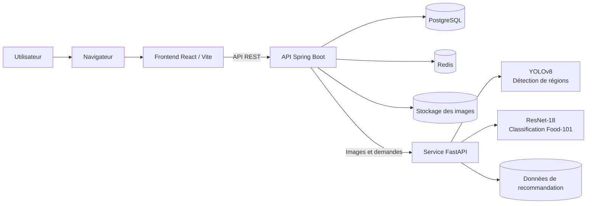

# SmartMeal — Mieux comprendre son assiette, une photo à la fois

SmartMeal transforme une photo de repas en un aperçu simple des aliments détectés et de leurs repères nutritionnels. L’application réunit l’analyse d’image, un score de lecture rapide, un historique personnel et des suggestions pour aider chacun à explorer ses choix alimentaires.

Le projet vise à rendre l’information nutritionnelle plus accessible au quotidien : comprendre plus facilement ce qui se trouve dans son assiette, retrouver ses analyses et s’appuyer sur des repères clairs pour faire des choix plus éclairés. Cet impact est un objectif du produit, pas une mesure clinique ou une étude d’efficacité.

## Ce que SmartMeal permet de faire

- **Analyser une assiette en quelques étapes :** créer un compte, importer une photo JPEG ou PNG (20 Mo maximum) et obtenir un aperçu des aliments reconnus.
- **Repérer les aliments avec l’IA :** YOLOv8 localise des régions de l’image, puis un modèle ResNet-18 les classe parmi les 101 catégories de Food-101.
- **Lire les repères nutritionnels :** consulter les estimations disponibles pour les calories, protéines, glucides, lipides, fibres, sodium et sucres.
- **Comprendre le résultat d’un coup d’œil :** voir un score indicatif sur 100 et une lettre de A à E, calculés à partir de quelques seuils nutritionnels.
- **Garder le fil de ses analyses :** retrouver les repas enregistrés dans son compte, consulter leurs détails et parcourir les analyses récentes depuis le tableau de bord.
- **Découvrir des idées de repas :** explorer des suggestions calculées à partir des données de recommandation fournies avec le projet.

## L’impact visé

SmartMeal réduit la distance entre une photo et une information utile : il rassemble dans une même expérience la reconnaissance des aliments, des repères nutritionnels lisibles et la possibilité de revenir sur ses repas. L’historique aide à garder une trace de ses analyses, tandis que les suggestions ouvrent des pistes pour varier ses choix. L’application est conçue comme un outil de découverte et de sensibilisation, pas comme un régime ou un suivi médical.

## Parcours utilisateur

1. L’utilisateur crée un compte ou se connecte.
2. Il choisit une photo nette de son repas et lance l’analyse.
3. SmartMeal détecte les régions pertinentes et propose les aliments les plus probables.
4. L’application associe les données nutritionnelles disponibles, calcule un score indicatif et enregistre l’analyse.
5. L’utilisateur consulte le résultat, le retrouve dans son historique et peut explorer les suggestions associées.

Les résultats dépendent de la photo et des aliments couverts par Food-101. Les valeurs nutritionnelles sont des repères par 100 g, sans estimation du poids des portions. Le score est une heuristique logicielle ; SmartMeal ne remplace pas un avis médical ou diététique.

## Technologies

- **Frontend :** React, TypeScript, Vite et Tailwind CSS.
- **API :** Java 17, Spring Boot et Spring Security.
- **Données :** PostgreSQL et Redis.
- **Analyse d’images :** Python, FastAPI, PyTorch et YOLOv8.
- **Lancement local :** Docker Compose.

## Architecture

SmartMeal sépare l’interface, la logique applicative et l’inférence des modèles. Le navigateur échange avec l’API Spring Boot, qui gère les comptes et les analyses, enregistre les données et appelle le service ML lorsque nécessaire.



- **Frontend React :** permet de créer un compte, envoyer une image et consulter les résultats, le tableau de bord et l’historique.
- **API Spring Boot :** orchestre les analyses, l’authentification, les données de repas et les repères nutritionnels.
- **Service FastAPI :** exécute les modèles d’image et produit les suggestions à partir des données de recommandation du projet.
- **PostgreSQL et Redis :** stockent les données applicatives et prennent en charge les besoins temporaires de session et de traitement.
- **Stockage des images :** conserve les fichiers reçus par l’API dans un volume Docker local.

## Structure

```text
frontend/              Interface web React
smeal-backend/         API Spring Boot et service FastAPI
models/                Poids des modèles et données de recommandation
notebooks/             Notebooks d’expérimentation
src/                   Ancien prototype Streamlit
```

## Démarrage local

### Prérequis

- Docker Desktop avec Docker Compose.
- Node.js et npm pour lancer l’interface web.
- Une connexion Internet lors du premier build Docker.

### 1. Configurer l’environnement

À la racine du dépôt, créez votre fichier local à partir du modèle :

```powershell
Copy-Item .env.example .env
```

Dans `.env`, définissez vos propres valeurs pour `DATABASE_PASSWORD` et `JWT_SECRET`. Utilisez un secret JWT aléatoire d’au moins 32 octets. Ne publiez pas `.env` et n’inscrivez pas de vrais secrets dans le dépôt.

### 2. Démarrer les services

Depuis la racine du dépôt :

```powershell
docker compose --env-file .env -f smeal-backend/docker-compose.yml up --build
```

L’API locale est disponible à `http://localhost:8082/api`. Son contrôle de santé se trouve à `GET /api/v1/health`.

### 3. Démarrer l’interface

Dans un autre terminal :

```powershell
cd frontend
npm install
npm run dev
```

Vite affiche l’adresse locale de l’interface, généralement `http://localhost:5173`. Pour utiliser une autre adresse d’API, définissez `VITE_API_URL` dans `frontend/.env.local`, avec `/api` à la fin de l’URL.

## Configuration

| Variable | Description |
|---|---|
| `DATABASE_PASSWORD` | Mot de passe PostgreSQL requis par Docker Compose. |
| `JWT_SECRET` | Secret utilisé pour signer les jetons d’authentification. |
| `DATABASE_URL` | URL JDBC de PostgreSQL. |
| `DATABASE_USERNAME` | Identifiant PostgreSQL. |
| `REDIS_HOST`, `REDIS_PORT` | Adresse et port de Redis. |
| `ML_API_URL` | Adresse du service d’analyse d’images. |
| `UPLOAD_PATH` | Répertoire de stockage des images reçues. |
| `FRONTEND_ORIGIN` | Origine frontend autorisée par CORS. |
| `VITE_API_URL` | URL de base de l’API utilisée par le frontend. |

Les ports locaux configurés par Docker Compose sont `8082` (API), `5000` (analyse d’images), `5433` (PostgreSQL) et `6380` (Redis). Cette configuration vise le développement local. Avant tout déploiement, configurez notamment HTTPS, des secrets propres à l’environnement et des règles réseau adaptées.

## Modèles et données

- `models/resnet18_food101.pth` : classifieur Food-101 utilisé par le service d’analyse.
- `yolov8n.pt` : poids du détecteur YOLOv8.
- `models/rl_results.json` : données utilisées par les suggestions.
- `notebooks/` : exploration des données et expérimentations ML.

Le jeu d’images Food-101 n’est pas inclus. Certains notebooks et l’ancien prototype utilisent des chemins locaux à adapter avant exécution. L’application web n’a pas besoin de ces notebooks pour démarrer.

## Utilisation des images et estimations

Le service conserve les images reçues dans son répertoire de stockage local. Prévoyez une politique de conservation et de suppression adaptée avant d’utiliser l’application avec des données personnelles ou en production.

Les classes Food-101 ne couvrent pas tous les plats. Les informations nutritionnelles sont des repères par 100 g et l’application n’estime pas la taille des portions. Le score affiché est une heuristique indicative.
